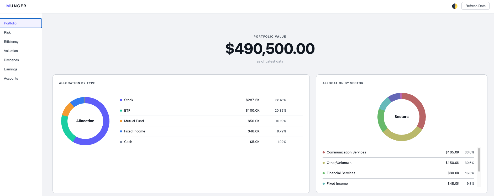

# Munger

A local-first, high-security portfolio analysis dashboard. Reads holdings from Monarch Money (recommended), Google Sheets, or a local CSV, deduplicates positions across accounts, and serves a web UI with deep architectural analysis views.



## Features

- **Monarch Money integration** — fetches live portfolio via GraphQL API, stores full JSON response locally
- **Google Sheets integration** — OAuth2 Authorization Code Flow, no service accounts
- **CSV fallback & portfolio switcher** — drop in local files and switch between portfolios on the fly
- **Position deduplication** — merges the same security held across multiple accounts by `security_id`
- **Asset class & sector normalization** — maps cash and fixed income tickers to canonical types and enriches sector weights
- **Interactive Concentration Treemap** — Squarified Treemap heatmap revealing true concentration across direct and look-through fund holdings
- **Capital Gains & Tax Liability Modeling** — estimates taxable capital gains and federal/state tax liability across configurable tax rates
- **Intrinsic Valuation & Sensitivity Matrix** — 2-stage FCF DCF intrinsic value and Margin of Safety for stocks and ETFs, with interactive WACC/growth sensitivity modeling
- **Stock Detail & Look-Through Mapping** — comprehensive drilldown for any security showing direct account shares and indirect fund exposure
- **Fee Efficiency & Wealth Gap Projections** — asset-by-asset compounding against a zero-fee benchmark over 10, 20, and 30 years
- **Market data enrichment & SQLite cache** — dividend yield/rate, EPS, P/E, sector, market cap via yfinance with resilient local SQLite caching and offline fallback
- **Theme toggle** — clean Monarch-style UI with instant dark and light mode toggle
- **Local-first & zero cloud** — all financial data stays on your machine; only ticker symbols leave the machine

## Dashboard

Run the FastAPI backend and open `http://localhost:8000`:

```bash
uvicorn main:app --reload
```

### Portfolio tab
Net worth hero, asset class allocation bar chart, sector allocation breakdown, concentration risk alerts, institutions breakdown, and interactive positions table with asset/sector filters.

### Risk tab
Finviz/Bloomberg-style **Squarified Treemap Heatmap** displaying true portfolio concentration across direct positions and look-through index fund constituents (e.g. S&P 500 funds). Color-coded by risk threshold (>10% red alerts, 5–10% amber, 2–5% blue core, <2% purple) with Top 25, Top 50, and All Exposures toggles. Clicking any tile opens that security's detail page.

### Accounts tab
Three-bucket asset allocation (Taxable / Tax-Deferred / Tax-Exempt) with portfolio weights and account breakdown. Features an integrated **Capital Gains & Tax Liability** calculator with tax rate presets (15%, 20%, 23.8% NIIT, 33% CA/NY) and an informational gain breakout for retirement accounts. Click any account name to view a full holdings breakdown with cost basis and unrealized gain/loss.

### Valuation tab
Buffett-style 2-stage FCF DCF Intrinsic Valuation table calculating Free Cash Flow, Debt-to-Equity, ROE, WACC, and Margin of Safety (MOS). Aggregates underlying look-through valuations for ETFs. Click any intrinsic price to launch an interactive 5×5 sensitivity matrix across varying discount and growth rates.

### Efficiency tab
Calculates portfolio Weighted Expense Ratio, annual fee drag in dollars, identifies high-fee funds, and projects 10/20/30-year wealth gaps using asset-by-asset compounding against a zero-fee benchmark.

### Dividends tab
Projected annual dividend income hero, yield, and cashflow split by tax bucket. Per-bucket tables show Ticker · Name · Value · Type · Annual $/Share · Yield · Projected Income with sortable columns.

### Earnings tab
Weighted-average trailing P/E hero, split by tax bucket. Per-bucket tables show Ticker · Name · Value · Type · Sector · Trailing EPS · Trailing P/E · Forward P/E · Market Cap with sortable columns.

### Ticker Detail View
Clicking any ticker link or heatmap tile navigates to a dedicated stock overview displaying Market Cap, Trailing P/E, Dividend Yield, and Expense Ratio / Ex-Div Date. Displays all accounts holding the security directly (with cost basis and gain/loss) as well as look-through indirect exposure through portfolio funds with implied dollar values.

## Command Line Interface

You can print a quick summary directly to the terminal without starting the web server:

```bash
python cli.py
```

## Setup

```bash
pip install -r requirements.txt
cp .env.example .env
# edit .env with your data source
```

### Monarch Money (recommended)

Monarch Money authenticates via session cookies (with CSRF validation). Obtain your session cookie from the Monarch web app:

1. Open [Monarch Money](https://app.monarch.com) in your browser and log in.
2. Open DevTools (`Cmd + Option + I` or `F12`) → **Network** tab.
3. Select any request to `graphql`.
4. In **Request Headers**, copy the entire value of the `Cookie` header.

Fetch fresh data using your cookie:

```bash
python monarch.py --cookie "PASTE_COOKIE_STRING"
# or set MONARCH_COOKIE in .env and simply run:
python monarch.py
```

*(Token authentication is also supported if you have an active API token: `python monarch.py --token YOUR_TOKEN` or via `MONARCH_TOKEN` in `.env`)*

Set `MONARCH_JSON_PATH=monarch_response.json` in `.env` to use it as the data source. Re-run `monarch.py` whenever you want fresh data, then hit **Refresh Data** in the dashboard. If the file is missing, the backend will safely fallback to your spreadsheet or CSV configuration.

### Google Sheets

Download your OAuth client secret from Google Cloud Console and save it as `credentials.json` (or set `GOOGLE_CREDENTIALS_PATH`). A browser window opens on first run to authorize; the token is cached locally in `token.json`.

## Google Sheet Format

The sheet must have these columns:

`account_id`, `account_name`, `account_mask`, `institution_name`, `holding_name`, `ticker`, `type_display`, `quantity`, `value`, `security_id`, `security_name`, `price_updated`

## Configuration

| Variable | Default | Description |
|---|---|---|
| `MONARCH_JSON_PATH` | — | Path to stored Monarch response JSON (highest priority) |
| `MONARCH_COOKIE` | — | Monarch session cookie string (used by `monarch.py` to fetch fresh data) |
| `MONARCH_TOKEN` | — | Monarch API token (alternative auth for `monarch.py`) |
| `CSV_PATH` | — | Local CSV path |
| `SHEET_ID` | — | Google Sheet ID (from URL) |
| `GOOGLE_CREDENTIALS_PATH` | `credentials.json` | OAuth client secret file |
| `CONC_THRESHOLD` | `10.0` | Flag any position exceeding this % of portfolio |

## Testing

The codebase is decomposed into independent modules (`core/`, `data/`, `metrics/`) which are tested via `pytest`.

```bash
pip install pytest
pytest tests/
```

## Security

- Secrets in `.env` — never committed
- `.gitignore` enforced at startup (`*.csv`, `*.json`, `*.env`, `*.db`)
- Only ticker symbols leave the machine (yfinance market data fetch)
- No analytics or telemetry
- All logging to stdout only
